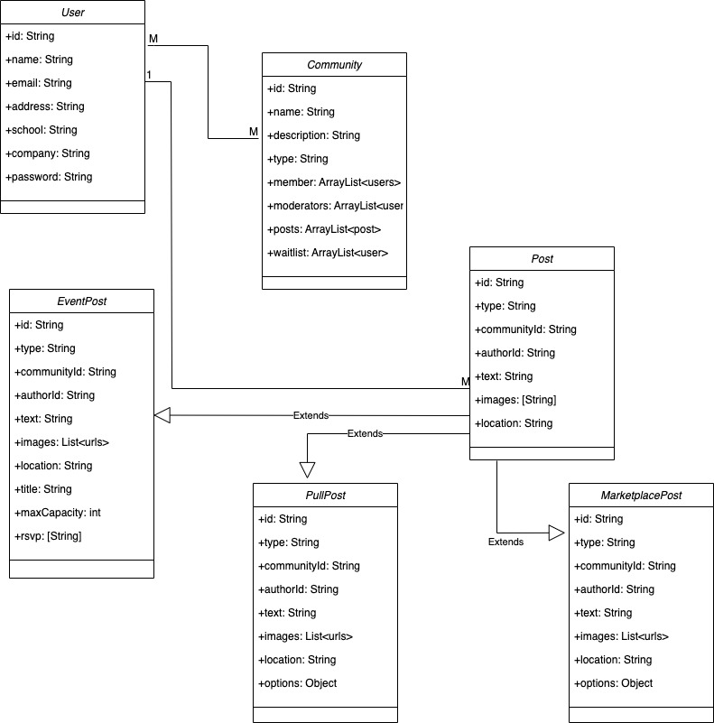

# TEAM PIXEL : COMMUNITIES

## :busts_in_silhouette: TEAM:

1. KARAN WADHWA - 002663034

2. FORAM KAMANI - 002732551

3. CHRIST RODRIGUES - 002727863

## :package: ABOUT COMMUNITIES

1. Communities is a social media platform created to facilitate connections among individuals who reside in the same area, attend the same school or work for the same company.

2. Through Communities, users can stay up-to-date with local events, exchange information with neighbors, and coordinate community gatherings.

3. The application also provides users with the ability to create and attend events, as well as create polls on various subjects.

4. Additionally, Communities includes a marketplace feature that enables individuals to purchase and sell items online.

## :rocket: Quickstart

1. Clone repository

```console
$ git clone https://github.com/neu-mis-info-6150-spring-2023/final-project-group-team-pixel.git
```

2. Install packages

```console
$ cd backend && npm install
```

```console
$ cd frontend && npm install
```

3. Initialize a remote MongoDB instance
4. Signup for Twilio

5. Set environment variables from `.example.env` files
   5.1 Create `.env` file for the backend project

```console
$ cd backend && touch .env
$ cp .example.env .env
```

5.2 Create `.env` file for the frontend project

```console
$ cd frontend && touch .env
$ cp .example.env .env
```

5.3 Update environment variables

6. Build and run backend project

```console
$ npm run build
$ npm run start
```

7. Run frontend project

```console
$ npm run start
```

8. Build frontend project for deployment

```console
$ npm run build
```

# Features

##### 1. Login and Signup

Allows user to create a new profile or login into existing account

##### 2. Search Communities

Gives user freedom to search communities based on their location, school, companies, and local communities

##### 3. Join or Leave Communities

Allows user to join or leave community at any point of time

##### 4. Different types of Posts

Allows user to create, update, read, and delete posts

##### 5. MarketPlace

Buy and Sell products online

##### 6. Host Events

Host community Events

##### 7. Conduct Polls

Ask other users for suggestions on your ideas

##### 8. Dark and Light Mode

Allows user to switch between dark and light mode

##### 9. Update User Profile

Allows user to update details

##### 10. Google Maps Integration

Tag geo locations on posts

##### 11. SMS Notifications

Send SMS notifications to users via Twilio

##### 12. Secure Authentication

Secure REST API authentication and password hashing using Bcrypt

##### 13. Upload Images to Cloud

Upload images to AWS S3

#### 14. Text to Speech

Allow users to convert written text from posts into spoken words

#

**User Stories**

1. As a user, I want to create a new account so that I can access the application features.

2. As a user, I want to be able to log in to my account easily and securely once I have created an account.

3. As a user, I want to be able to customize my profile with my personal information and preferences.

4. As a user, I want to look at the main dashboard(feed) which includes posts from the communities that I have joined.

5. As a user, I should be able to search for communities based on various factors which includes location, company name, school name, and local communities name.

6. As a user, I should be able to tag my geo location on the post.

7. As a user, I should be able to join or leave communities.

8. As a user, I should be able to join or create communities so that I can connect with like-minded users and participate in related activities or events.

9. As a user, I should be able to create, update, read, and delete the event post.

10. As a user, I want to organize or attend local events like community potlucks, yard sales, and more, so that I can meet and connect and build a sense of community.

11. As a user, I should be able to create a poll for others to vote.

12. As a user, I want to buy and sell items with my fellow community users through a local classifieds section, so that I can support local businesses and reduce my environmental impact.

13. As a user, I should be able to switch to dark or light mode.

14. As a user, I want to be able to browse different categories of content so that I can explore the app's offerings and discover new things.

15. As a user, I should be able to logout.

16. As a user, I want to receive messages or be alerted about notifications from my community.

17. As a user, I want to be able to contact the application developers and give relevant feedback and suggestions.

#

### Milestone 1: Login and Signup Functionality

1. Develop a system for users to create new accounts and securely log in to the app

2. Implement basic profile customization options (e.g. profile picture, username, etc)

### Milestone 2: Dashboard

1. Build an application for users to search for different communities.

2. Feature to allow users to join or create communities.

3. Feature that allows users to create, delete, read, and update event posts.

4. Develop a marketplace for users to buy and sell products.

### Milestone 3: SMS Notification

1. Feature to send sms notifications to the users when the signup for communities, or join communities.

### Milestone 4: Dark and Light Mode

1. Implement a feature for users to switch between dark and light mode.

#


